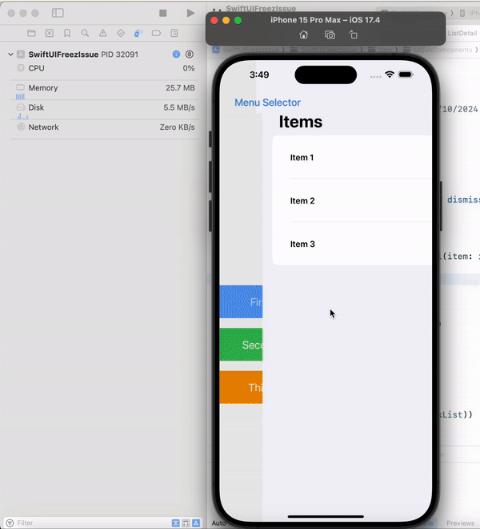

# SwiftUI Issue: App Freezes with `@Environment(.dismiss)` and Callback

## Description

I've encountered an interesting issue while working on a SwiftUI project, specifically when using `@Environment(\.dismiss)` along with a callback function like `onSuccess: (Bool) -> Void` in a `ListDetail` view. The app starts freezing, and CPU utilization spikes to 99%.

The repository now contains two branches:
- **`issue/swiftui-freezing`**: This branch keeps the original code that reproduces the issue as encountered.
- **`main`**: This branch contains the fixed code, which resolves the freezing problem.

### Problem:

- **Scenario:**
  - Using `@Environment(\.dismiss)` in the `ListDetail` view.
  - Including a callback function, `onSuccess: (Bool) -> Void`, to handle success scenarios for ListDetail.

- **Symptoms:**
  - The app freezes when these two components are used together.
  - CPU utilization spikes to 99%, causing performance degradation.

- **Workaround:**
  - If I comment out `@Environment(\.dismiss)`, in the `ListDetail` view. or
  - Remove the `onSuccess` callback from ListDetail View, the app works perfectly fine without freezing.

### Steps to Reproduce:

1. Open the project.
2. Check these two files that are causing the issue:
   - **ListDetail.swift**
   - **ListView.swift**

   In both files, the combination of `@Environment(\.dismiss)` and the `onSuccess` callback is causing the freeze.

This issue raises the question of whether there is a potential conflict when using `@Environment(\.dismiss)` alongside a callback in SwiftUI.

### Versions:
- Xcode: 15.2
- iOS: 17.2
- macOS: 14.6.1
